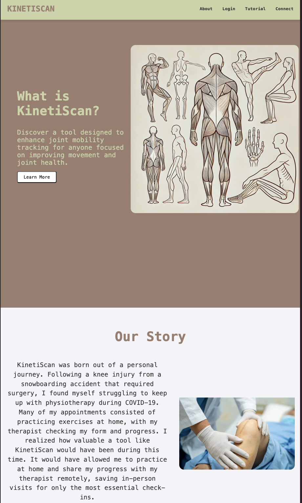
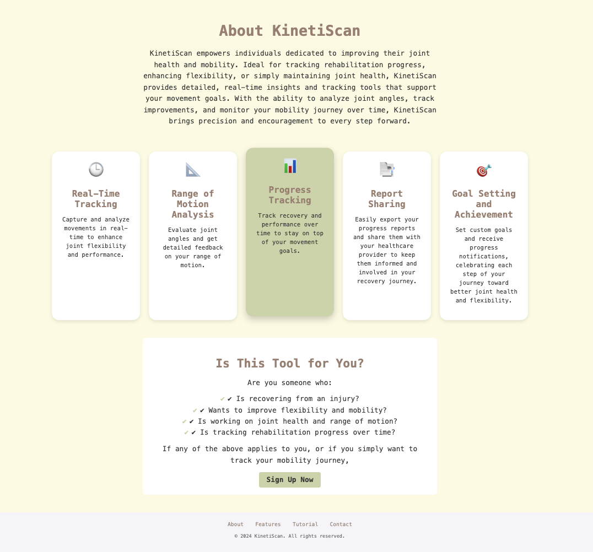
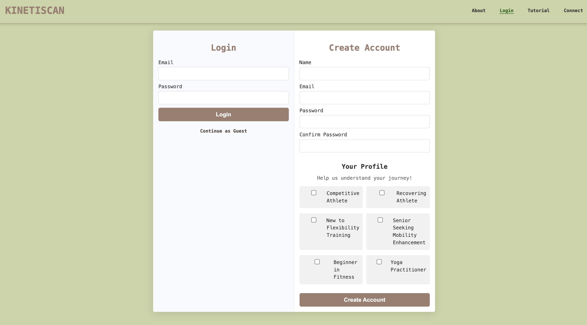
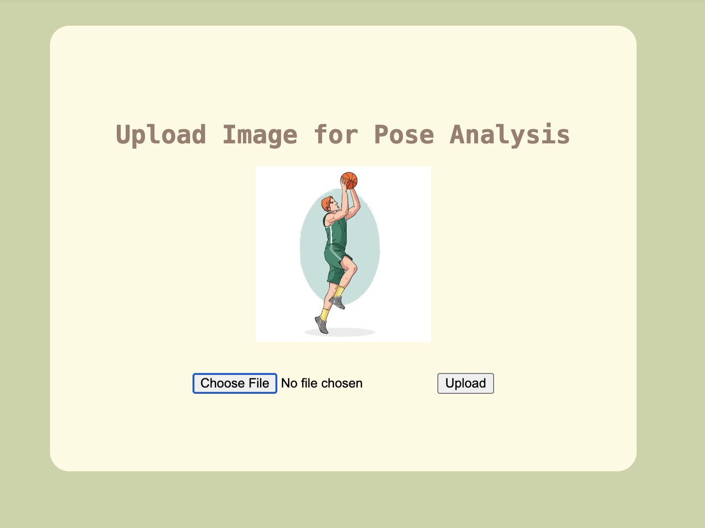
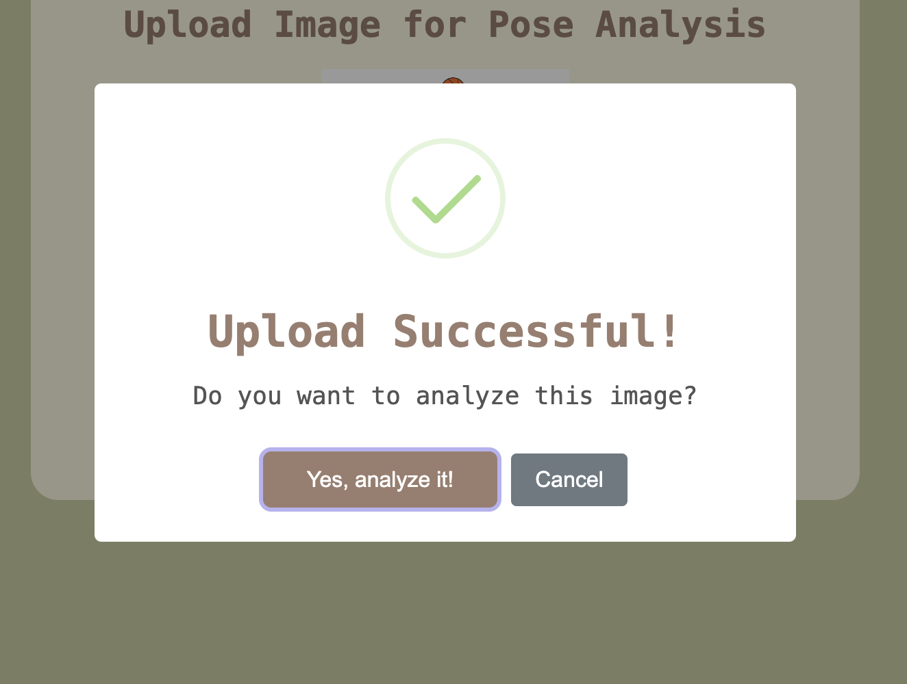
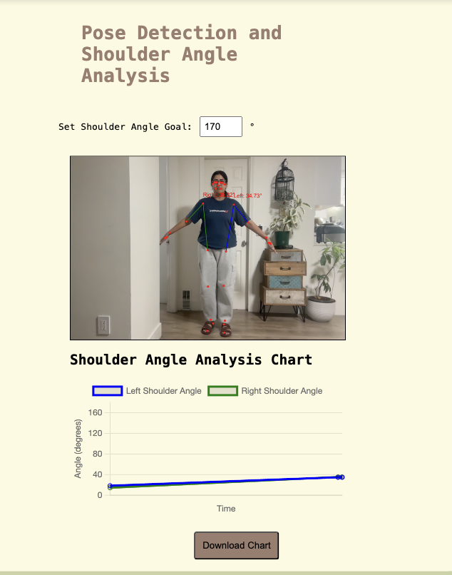
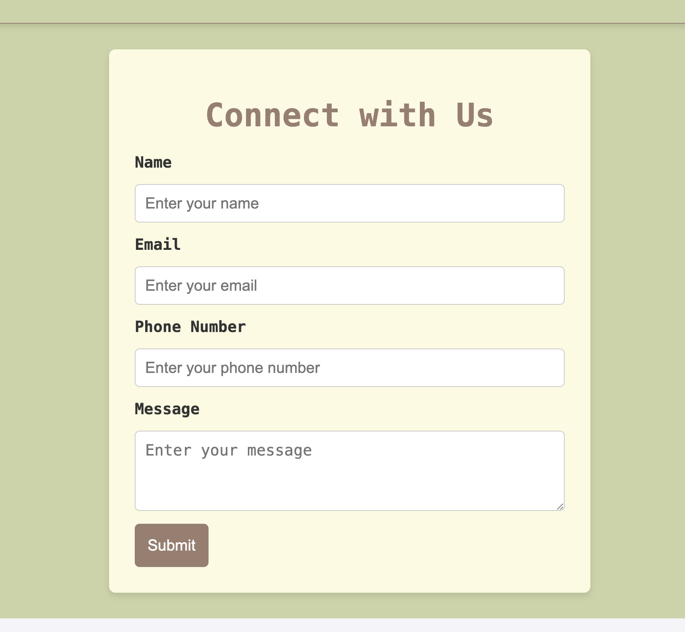
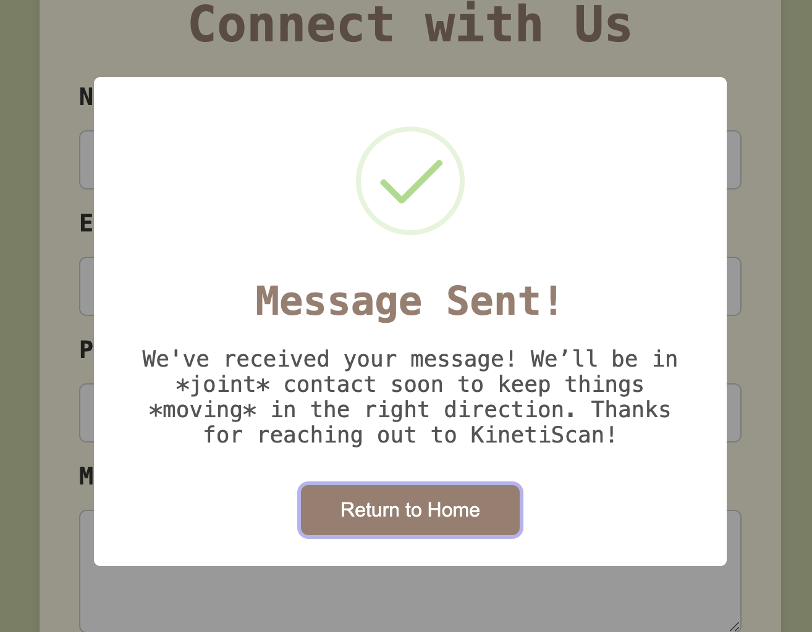

# KinetiScan

## Overview

KinetiScan is an application designed to help users analyze their joint movements and track their range of motion for recovery purposes. It is primarily focused on athletes and individuals undergoing rehabilitation. By using computer vision trainable models, the app provides real-time feedback, generates progress charts, and allows users to track their progress over time.

### Problem Space

People recovering from injuries or improving athletic performance often need to monitor their joint movements and range of motion closely. However, it is challenging to track this progress accurately without medical assistance. KinetiScan solves this by allowing users to record their movements, analyze their joint angles, and receive feedback on how much they have improved. This can speed up recovery and ensure exercises are done correctly.

### User Profile

- Athletes and fitness enthusiasts tracking movement performance
- People recovering from injury needing to monitor their joint movements
- Physical therapists or healthcare professionals who want to monitor patients remotely

### Features

- **Real-time Joint Movement Tracking**: Capture and track joint movements using the device’s camera.
- **Range of Motion Analysis**: Analyze the user’s joint angles and provide feedback on the range of motion.
- **Progress Tracking**: Users can view historical data and track their recovery progress over time.
- **Goal Setting**: Set custom goals and receive progress notifications, celebrating each step of your journey toward better joint health and flexibility.
- **Report Sharing**: Users can download progress charts to share with their health care provider.
- **Connect Form**: Users can email feedback to the KinetiScan team (aka me) for feedback and suggestions.

## How to Use

**Get repos**
1. clone the frontend https://github.com/gillnim/KinetiScan.git
2. clone the backend https://github.com/gillnim/KinetiScan-server.git

**run commands**
3. run following commands in both client and server
4.  ```bash
     npm i
     ```
5. ```bash
     npm run dev
     ```

## Implementation

## Tech Stack

### Frontend

- **React.js**: Responsive and modular UI.
- **React Router**: For smooth client-side navigation.
- **Chart.js with react-chartjs-2**: Visualize joint angle progress over time.
- **SweetAlert2**: Beautiful alerts and confirmation dialogs.
- **HTML5 Media API**: Capture video streams for analysis.
- **SCSS**: Modular and maintainable styling.

### Backend

- **Node.js**: Server runtime for backend logic.
- **Express.js**: API routing and middleware management.
- **Multer**: Handles image uploads, allowing file storage and retrieval.
- **Axios**: Facilitates HTTP requests between frontend and backend.

### Database and Storage

- **JSON File Storage**: Stores angle data in a structured format (with potential MongoDB expansion).

### Computer Vision and Pose Detection

- **MediaPipe Pose**: Provides real-time joint detection and pose estimation.

### Utilities

- **EmailJS**: Automates email sending directly from the app.
- **confetti-js**: Adds celebratory effects for achieving movement goals.
- **date-fns**: Formats dates for consistency and readability in progress charts.

### Development and Testing

- **Visual Studio Code**: Primary development environment.
- **Git/GitHub**: Version control for source code management.

### Sitemap

- **HomePage**
- **LoginPage**
- **RecordPage**
- **AnalysisPage**
- **TutorialPage**
- **ConnectPage**
- **NotFoundPage**

### Mockups

- **Home Page**




- **Login Page**



- **Record and Analyse**





- **Connect Page**




### Data

**User Data**

- **Description**: Information specific to each user, such as goals, email (if sending notifications), and session activity.
- **Relationships**: Links to **Session Data** to retrieve historical movement and goal tracking.

**Session Data**

- **Description**: Each session captures data when a user uploads an image or completes an analysis. It includes:
  - **Date and Time**: Timestamp of when the analysis was conducted.
  - **Left and Right Shoulder Angles**: The measured angles calculated for each shoulder.
  - **Goal Status**: Whether the session met the user’s goal or not.
- **Relationships**: Connects to **User Data** for tracking individual progress and to **Progress Reports** for building historical charts and reports.

**Progress Reports**

- **Description**: A summary generated after each session or exported by the user to capture progress over time. Includes:
  - **Historical Angles**: Left and right shoulder angles over multiple sessions.
  - **Goal Status**: Highlights whether a goal has been reached in a session.
- **Relationships**: Draws from **Session Data** to generate charts and aggregate stats, which are shared through **Export Data**.

**Goal Data**

- **Description**: Stores user-defined or default goal settings for joint angles. Allows goal customization and sets thresholds to trigger celebratory feedback when reached.
- **Relationships**: Related to **Session Data** for real-time tracking and to **User Data** for storing preferred goal settings.

### Endpoints

The server includes the following endpoints for handling image uploads and angle data storage.

1. **Upload Image**

   - **Endpoint**: `/upload`
   - **Method**: `POST`
   - **Description**: Handles image uploads. Stores the uploaded image in the `/uploads` directory and returns the image URL.
   - **Parameters**:
     - `image` (file): Image file to be uploaded.
   - **Example Request**:
     ```bash
     POST /upload
     Content-Type: multipart/form-data
     ```
   - **Example Response**:
     ```json
     {
       "imageUrl": "/uploads/1697935830000-image.jpg"
     }
     ```

2. **Get All Angle Data**

   - **Endpoint**: `/angles`
   - **Method**: `GET`
   - **Description**: Retrieves all recorded angle data stored in `data/angleData.json`.
   - **Example Request**:
     ```bash
     GET /angles
     ```
   - **Example Response**:
     ```json
     [
       {
         "timestamp": "2024-10-27T01:30:04.902Z",
         "leftShoulderAngle": 30.93,
         "rightShoulderAngle": 27.94
       },
       {
         "timestamp": "2024-10-27T01:32:04.902Z",
         "leftShoulderAngle": 40.12,
         "rightShoulderAngle": 35.45
       }
     ]
     ```

3. **Add New Angle Data**
   - **Endpoint**: `/angles`
   - **Method**: `POST`
   - **Description**: Adds a new set of angle data to the JSON file `data/angleData.json`.
   - **Parameters**:
     - **Body**:
       - `timestamp` (string): ISO string representing the date and time of the recorded data.
       - `leftShoulderAngle` (number): Angle of the left shoulder.
       - `rightShoulderAngle` (number): Angle of the right shoulder.
   - **Example Request**:
     ```json
     {
       "timestamp": "2024-10-27T01:32:04.902Z",
       "leftShoulderAngle": 40.12,
       "rightShoulderAngle": 35.45
     }
     ```
   - **Example Response**:
     ```json
     {
       "message": "Data saved successfully."
     }
     ```

---

### Roadmap

1. **Frontend Setup**
   - Configure React project with routing and initial boilerplate pages.
   - Integrate camera access for pose capture using HTML5 Media API.

2. **Backend Setup**
   - Set up a Node.js (Express) server for handling API requests and file uploads.
   - Use a simple JSON file for data storage of angle data and goal tracking.

3. **Real-Time Pose Tracking and Analysis**
   - Implement pose estimation with MediaPipe for capturing and analyzing joint angles.
   - Integrate angle calculation to support real-time feedback on shoulder joint movement.

4. **Goal Tracking and Notifications**
   - Allow users to set and modify goal angles for shoulder tracking.
   - Add visual confetti animation and fun notifications when goals are achieved, encouraging users to celebrate milestones.

5. **Progress Chart and Visualization**
   - Use Chart.js to visualize angle progression over time, including customizable date labeling.
   - Add export options to download progress charts, allowing users to save or share their movement history.

6. **Connect Page**
   - Implement a contact page where users can submit feedback or queries via a form.
   - Use EmailJS to send form submissions directly to a designated support email.


---

## Future Implementations

- **User Authentication**: Secure login and user data protection.
- **Mobile Compatibility**: A mobile-friendly design to allow users to easily record movements from their phones.
- **Integration** with health tracking devices
- **Gamification** adding achievements for users
- **Support** for multiple joint movements (shoulder, knee, etc.)
- **Live feedback** during exercises
